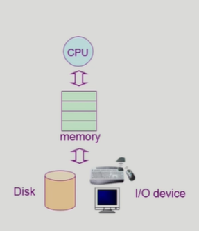

## 0718 운영체제 개요 및 컴퓨터 시스템의 구조 

영상: [운영체제](http://www.kocw.net/home/search/kemView.do?kemId=1046323)

### [1 운영체제 개요](https://core.ewha.ac.kr/publicview/C0101020140307151724641842?vmode=f) ​

### 운영 체제란?

- 컴퓨터 하드웨어 바로 위에 설치되는 소프트웨어 계층으로서 모든 컴퓨터의 필수적인 부분 = OS

- ##### 목표: 운영체제의 개념과 역할, 구성 요소에 대해 학습하자 :construction:

> 협의의 운영체제 : 커널 (항상 메모리에 상주하는 부분)
>
> 광의의 운영체제 : 커널 뿐 아니라 각종 주변 시스템 utility 포함 

### 운영 체체의 목적

- 하드웨어를 편하게 사용할 수 있는 환경을 제공 
  
- 사용자 / 프로그램들이 각각 독자적 컴퓨터에서 수행되는 것 같은 환상을 제공 
  
- ##### 자원을 효율적으로 관리하는 것 ( 프로세서, 기억장치, 입출력 장치 )

### 운영 체제의 분류

> 동시 작업 가능 여부 :construction_worker:
>
> - 단일 작업 : MS-DOS의 경우 한 번에 하나의 작업만 처리 
> - **다중 작업** : UNIX, MS Windows, 스마트폰 실행 도구 

> 사용자의 수 :person_frowning:
>
> - 단일 사용자 : MS-DOS, MS Windows ( 요즘은 다중 계정 생성됨)
> - **다중 사용자** : UNIX, NT server 

> 처리 방식 :electric_plug:
>
> - 일괄 처리 : 작업 요청의 일정량 모아서 한꺼번에 처리 ex 초기 punch card 처리 시스템 
> - **시분할** : 여러 작업을 수행할 때 컴퓨터 처리 능력을 일정한 시간 단위로 분활하여 사용 ex UNIX
> - 실시간 : 정해진 시간 안에 어떠한 일이 반드시 종료됨이 보장되어야 하는 실시간 OS ex 특수 목적을 가진 시스템에서 사용 

### 몇 가지 용어

- Multitasking / Multiprogramming / Time sharing / Multiprocess 
  - 컴퓨터에서 여러 작업을 동시에 수행하는 것을 뜻한다. 
  - multiprogramming은 여러 프로그램이 메모리에 올라가 있음을 강조 
  - time sharing은 cpu의 시간을 분하하여 나누어 쓴다는 의미를 강조 

### 운영 체제의 예

- UNIX 
  - 코드 대부분을 C언어로 작성 
  - 최소한의 커널 구조
  - 복잡한 시스템에 맞게 확장 용이
  - 리눅스가 너무 복잡하여서 그것을 잘 활용할 수 있는 언어를 만듦 > C언어
  - 다른 컴퓨터에 이식하기 좋음 

- MS Windows 
  - 개인용 컴퓨터를 위함 
  - DOS용 응용 프로그램과 호환성 제공 

### 운영 체제의 구조

- 누구한테 CPU를 할당할지 > **CPU 스케줄링** 
  - 짧은 시간 내에 최대한 할당을 효율적으로 이루게 하려고 함 
- 한정된 메모리를 어떻게 쪼개어 쓰지? > **메모리 관리** 
- 디스크에 파일을 보관하는 방법 > **파일 관리** 

- 각기 다른 입출력 장치와 컴퓨터간 정보 주고 받기 > **입출력 관리**

## [2 시스템 구조 및 프로그램의 실행 Part-1](https://core.ewha.ac.kr/publicview/C0101020140311132925816476?vmode=f)

### 컴퓨터 시스템 구조

- CPU - Memory - Disk / I O device 

- cpu와 I/O device 성능차이는 백만배 정도 발생

  - cpu는 memory 에서 instructure를 하나씩 실행

  - cpu의 interrupt line은 매 instructure를 실행하고 그 다음거를 실행하기 전 붙는 것 

    

### Mode bit

- 사용자가 프로그램의 잘못된 수행으로 다른 프로그램 및 운영체제에 피해가 가지 않도록 하기 위한 보호 장치 필요 

### Timer

- 특정 프로그램이 CPU 독점하는 것을 방지하기 위해 할당한 시간을 부여해서 

  타이머 값이 0이 되면 해당 프로세스 종료 

### Device Controller :control_knobs: (hardware)

- I/O 장치유형을 관리하는 일종의 작은 CPU
  - CPU는 memory, local buffer 모두 접근 가능 
  - 그러다 보니 CPU가 너무 interrupt가 많이 발생함 
  - 그래서 DMA controller를 이용 
    - 직접 메모리에 access 할 수 있는 컨트롤러
    - cpu와 dma controller가 메모리 둘 다 접근 가능해서 누군가 먼저 접근할 지 조율하는 역할을 한다. 

### [입출력과 인터럽트 (Input-Output and Interrupt)]

### 시스템 콜 (System Call)

- memory 에서 I/O를 호출하는 것 
- 프로그램이 운영체제한테 요청하고 os 가 거는 interrupt가 system call? 

