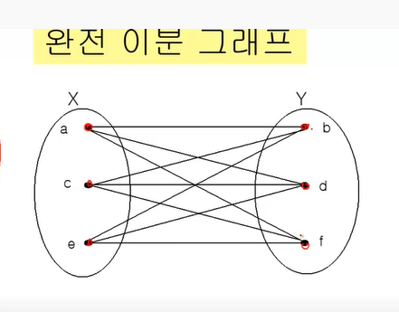

# 알고리즘, 그래프

### 알고리즘

- 문제를 해결하기 위해 절차를 기술한 것 
- 누구나 정해진 절차대로 실행할 수 있어야 한다. 

- **일정 시간**안에 **같은 input에 같은 output**이 나와야 한다. 

##### 가능 구조 

- 순차적 구조 
- 분기구조
- 반복구조
- 점프구조 

##### 알고리즘 기술 방법

1. 플로우 차트 
2. 프로그램 언어의 코드 (언어의 문법 수준으로)
3. **Pseudocode**: 프로그램 언어들이 사용하는 구조 

### 오일러 순환과 해밀턴 순환

##### 쾨니스버그의 다리들과 그래프

- 이웃 마을을 방문하기 위해 서로 다른 7개 다리를 한번씩 다 이용하여 왔다갔다 해야 한다.
- 이게 가장 기본적인 *그래프* 개념 ! 

##### 오일러 경로

= 그래프 G의 모든 연결선을 한번만 방문하는 경로 

##### degree

= 차수    정점 u에 접합된 연결선의 수 

2개 이상의 정점을 갖는 루프가 없는 연결 그래프에서 홀수 차수를 갖는 정점이 하나도 없거나 오직 2개만 (시작, 끝) 만 존재해야 한다. 

##### 해밀턴 경로 

그래프 G에서 모든 정점을 정확히 한 번만 지나가야 함 (다시 출발점으로 안와도 됨)

* 해밀톤 순환: 돌아서 다시 출발점으로 도착해야 함 

##### 해밀턴 순환 찾는 알고리즘 복잡도

- O(X^n) - n은 정점의 수 
- 유사한 복잡도 문제 ) 암호 해독, 바둑, Bin packing 

### 기본 용어

- 루프: 연결선의 두 끝점이 같은 정점인 연결선
- 연결 그래프 / 비연결 그래프 (모든 정점 기준)

- 닫힌 경로 : v1, v2, v3 .... 에서 v1 = vn인 경로 
- 순환: 3개 이상의 연결선을 갖는 경로에서 어떤 연결선도 중복되지 않는 것 
- 동형 그래프: 다르게 보이더라도 결국 정점과 연결선이 모두 동일한 그래프
- 이분 그래프: 정점이 두 그룹으로 나눠진 그래프 (두 그룹 내 연결선이 없음)

- 평면그래프: 연결선끼리 서로 겹치는 구간 없이 펼칠 수 있는 그래프 

### 그래프 채색

- ex) 주파수 할당 : 각 셀마다 다른 주파수를 사용하는데 겹치는 부분은 한 개의 주파수 사용 가능, n개의 셀이 있을 때 몇 개의 주파수가 필요할까?
- 그래프 채색: 인접하고 있는 정점들은 서로 다른 색을 갖도록 하면서 그래프의 서로 다른 정점 색을 할당 
- 예전에 배운 색칠하기 경우의 수 같다...! 

##### 순서

1. 모든 정점들의 순서를 정한다. 
2. 모든 색상들의 순서를 정한다. 
3. From v1 to vn 조건을 만족하는 색상 중 가장 낮은 번호의 색상을 vi에 배정 

##### Greedy Algorithm

- 결정을 할 때 마다 최종 결과에 관계없이 그 순간에서 최선의 선택을 한다. 
- 그 순간의 선택은 그 순간에서 최적의 선택이다. 

ex) 260원을 100원, 50원, 10원으로 구성해라 

