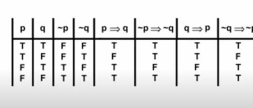

## 이산수학

### 학습 주제 

- 기본적인 명제와 연산자, 역, 이 대우 동치에 대해 학습
- 논리학, 집합론, 수론, 조합론, 관계, 그래프 이론 

#### 1차 논리 

- `a는 b다` 라는 명제가 존재하듯이 논리적 계산을 통해 참이라는 답을 내릴 수 있는 것이 필요하다. 
- 컴퓨터는 물리적 한계를 가졌기 때문에 최고의 효율을 추구하기 위해 연산 구조를 잘 세워야 한다. 

#### 이항 관계

- n항 관계에서 n이 2인 특수 경우이다. 

- a는 b보다 크다 가 하위 개념이 될 수 있다. 

#### 불 대수 

- 논리게이트를 사용하여 연산 장치를 만들면 더 적은 비용으로 연산장치를 생산할 수 있게 된다. 

##### 이산수학 강좌 - 동빈나 

> 이산수학 개요 
>
> 알고리즘을 잘 익히기 위해 배우는 강의.. 

> 명제 구분 
>
> 명확하게 참과 거짓으로 구분할 수 있는 것 
>
> 연산자로 명제 다루기 
>
> : Not, And, Or, Exclusive or, Implication, Biconditional 

* Exclusive or : 배타적 논리합 : 둘 중 하나만 참일 때만 참으로 판단! 

- implication: p->q 함축 조건 > 진리표를 작성하여 판단해보자 

TT > T 

TF > F 

FT > T 

FF > T 

- Biconditional: p <-> q 쌍방 관계 (둘 값 일치만 T 반환)

EX) 명제 p가 '핸드폰은 돼지저금통이다' 일때 이것을 부정하고 진리값을 구하시오. 

정답: ~p으로서 참값을 가진다. 

> 역 이 대우 
>
> 진리표 

**역 : q > p** 

**이 : not q > not q** 

**대우 : not q > not p** 

> 동치 
>
> : 논리적으로 일치한다. 
>
> 더 쉬운 명제를 발견하기 위해 사용한다. 
>
> 즉, 복잡해 보이는 합성명제라도 간단한 명제로 바꿀 수 있게 도와준다. 

#### 논리적 동치 표

##### 드모르간 중요 (흡수법칙 작용)

#####  ex) (p v q) ^ (p v~q) = ~p^(q v ~q) = ~p v F 

