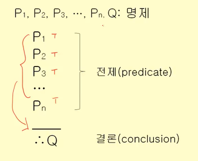
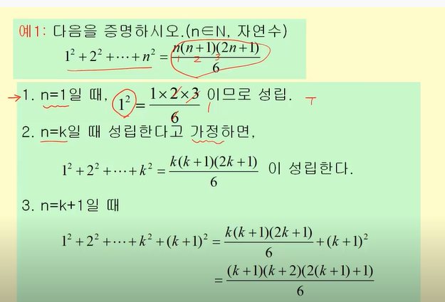
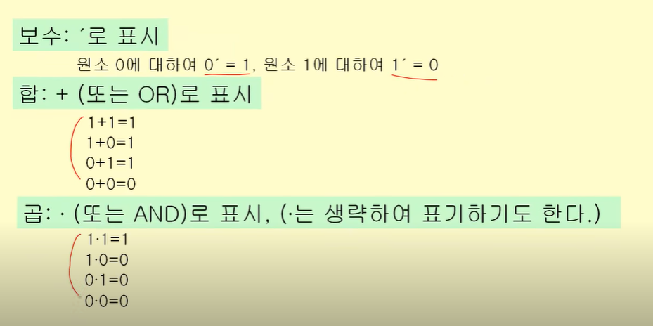
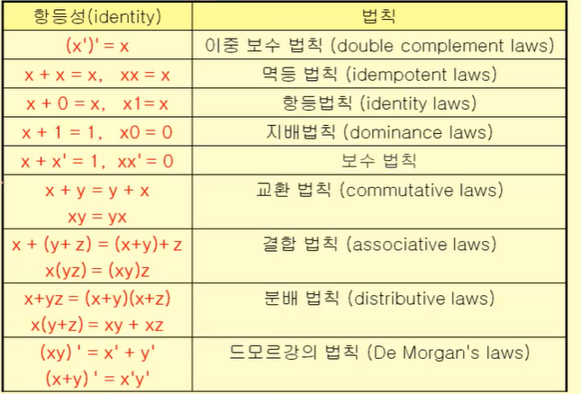

# 명제,추론,귀납,부울대수

### 명제 

> 7/7 필기 참고 

### 추론

- 추론: 이미 '참'으로 알고 있는 명제들로부터 새로운 '참'을 찾으려고 한다. 

##### 추론의 방법 

- 연역법) if P, then Q

   보통 연역법에 의해 명제들이 만들어진다. (정의, 이미 증명된 정리 등)

- 귀납법) 개별적인 사실들로부터 일반적인 결론을 도출하는 방법 

  한계: 도출된 결론은 기껏해야 **확률적인 결론** 뿐이다.... 

### 귀납

- 
- 주어진 식이 n = k+1 일 때도 성립하기 때문에 모든 n 에 대하여 성립한다. 

EX) 

만약 세금을 낮추면 소득이 올라간다. 그런데 소득이 올라갔다. 따라서 세금이 낮아졌다. ===> 연역

우리 대학을 20년 전에 졸업한 졸업생들의 연소득은 10억이다 ====> 귀납 

치명적 오류 (과도한 일반화를 할 수도 있음) 

결론을 도출하기 위해 사용한 전제가 무엇인가? >> 확인 해야 연역, 귀납 구분 가능 

### 부울대수 

부울 변수 = S = {0, 1}의 원소만 가지는 변수 

부울 식 = 부울 변수 하나하나가 부울 식이 된다. 

부울 변수와 부울 연산자로 이루어질 수 있다. 

##### 항등: n개의 변수로 이루어진 부울 함수 F, G가 있을 때 모든 변수에 대해여 F(x...) = G(x...) 라면 부울 함수 F, G는 동등하다. 

- 분배법칙, 교환법칙, 지배법칙, 항등법칙 ... 

###### 쌍대성 원리 

x + 0 = x, x*1 = x 이러한 쌍을 쌍대라고 한다. 

- 부울 식으로 표현된 함수들 사이에 항등성이 유지되면, 함수들 사이에 쌍대도 항등성을 유지한다. 

## 논리 회로 설계 

| 기본게이트 | 부울연산 |
| ---------- | -------- |
| 인버터     | 보수     |
| OR 게이트  | 부울 합  |
| AND 게이트 | 부울 곱  |

문제 > 입력과 출력 정의 > 부울식 설계 > 논리 회로 

