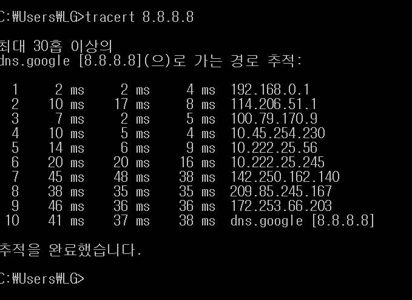

# 01 네트워크란 무엇인가?

(0510)

# 정의

> 네트워크란?
>
> 노드들이 데이터를 공유할 수 있게 하는 디지털 전기통신망의 하나! 
>
> * 여기서 노드는 네트워크에 속한 컴퓨터 .... 그래프 할 때 봤던 노드의 확장의미라고 해두자...

> 인터넷이란? 
>
> 문서, 그림, 영상과 같은 여러 유형의 데이터를 공유하도록 연결하는 큰 네트워크 


# 분류

> 크기에 따른 분류  :star::star::star:
>
> - LAN: 가까운 지역을 하나로 묶은 네트워크 (근거리 통신망)
>
> - WAN: 멀리있는 지역을 묶은 네트워크 
>
>   **즉!! LAN과 LAN을 하나로 묶은 것!!** 

> 연결 형태에 따른 분류  :star::star:
>
> - star형: 중앙 장비에 모든 노드가 연결 
> - Mesh형 : 서로 여러 노드가 그물처럼 연결 


# 통신방법

- 내가 원하는 특정 대상과만 통신 > uni 캐스트 
- 특정한 다수랑 통신 > multi 캐스트 
- 네트워크 상 모든 대상과 통신 > broad 캐스트 


# 실습

> 1. 구글 서버와 우리 컴퓨터 연결된거 확인 

```bash
$ tracert 8.8.8.8
```




> 2. wireshark 설치 후 프로토콜 확인 
>
> - 기능: 통신하고 있는 network 를 모두 보여줌! 


