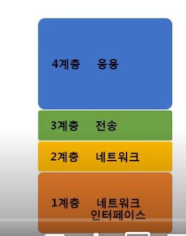
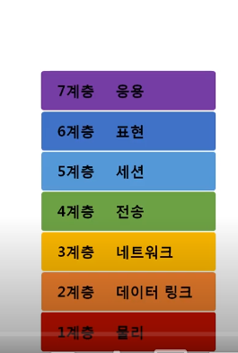

# 02 네트워크의 기준 

(0511)

#### 네트워크 모델의 종류 

- TCP / IP 모델 

- OSI 7 계층 

##### :floppy_disk:HTTP / TCP / UDP / IP / ICMP / ARP / 이더넷 --> 정도 중요 ! 

> 공통점 : 계층적 네트워크 모델이며 역할 정의를 함 
>
> 차이점: OSI는 역할 기반, TCP/IP는 프로토콜 기반  
>
> **OSI는 이론 느낌! TCP/IP는 실무 느낌** 

#### 네트워크를 통해 전달되는 데이터, 패킷! :electric_plug:

- 패킷이란? 

네트워크 상에서 전달되는 모든 데이터!  형식화된 블록처럼 여김 

- 구성 

##### :racing_car: 헤더 ㅡ 페이로드 ㅡ 풋터 (페이로드가 실질적인 부분 )

이 때 데이터를 하나씩 더해서 (헤더 역할로) 추가하는 과정을 **캡슐화**라고 함. 

이 때 추가한 데이터 말고 뒷부분은 전부 **페이로드**로 여겨짐! 

- 계층별 패킷의 이름 
  - 4계층 PDU = 세그먼트 
  - 3계층 PDU = 패킷
  - 2계층 PDU = 패킷 

### 실습 

- 아직 wire shark를 안다운 받아서 눈으로 보는중.....ㅋㅋㅋ
- 설치하고 다시 내용 채워넣겠슴당

### 

### 