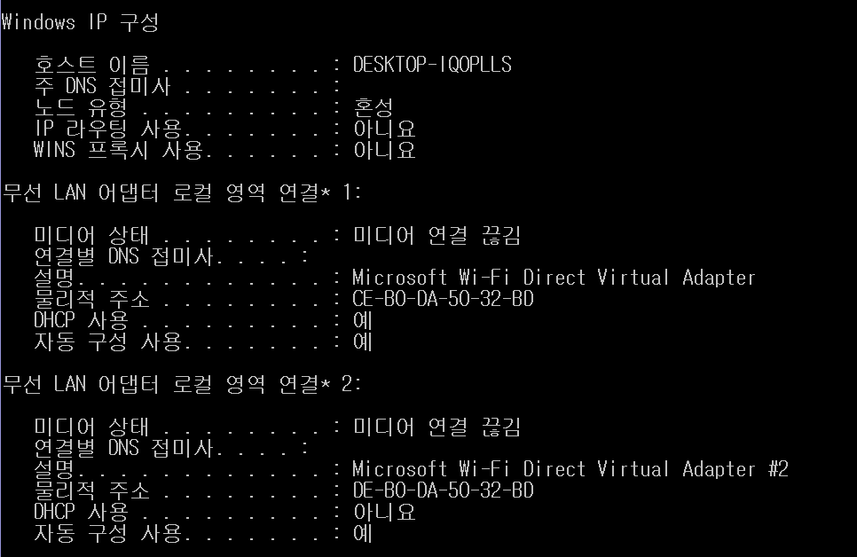

# 03 가까이 있는 컴퓨터끼리는 이렇게 데이터를 주고받는다. 

(0512)

#### 2계층에서 하는 일 :computer_mouse:

- 같은 LAN 대역에서 어떤 장비가 어떤 장비에게 보내는 데이터를 전달 
- 데이터의 오류 확인 및 흐름 제어 

:stadium: 다른 네트워크 대역과 통신을 주고 받을 경우 3계층이 무조건 필요함!!

##### 2계층에서 사용하는 주소 

- 물리적인 주소 : MAC 주소 (by 제조사 및 제품 etc)

#### 2계층의 프로토콜

- ethernet 목적지 주소에 MAC 주소가 적히는 구조!
- 받는 사람(Destination Address) - 보내는 사람(Source Address) - Ethernet Type 순서 (+ 뒤에 붙는 Data는 payload) + 16비트로 구성 
- MAC 주소 확인하기 `ipconfig/all`

