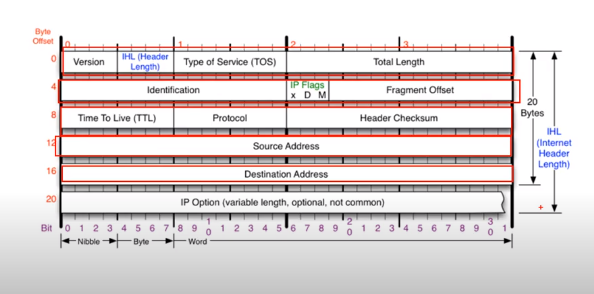
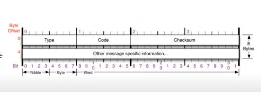

# 멀리있는 컴퓨터끼리는 이렇게 데이터를 주고 받는다 

(0519)

## :lion: IP v4 프로토콜 

- 네트워크 상에서 데이터를 교환하기 위한 프로토콜 이지만!
- 정확하게 데이터가 전달될 것을 보장되지 않는다....
  - 단순히 멀리 보내는 역할만 한다. 

- 구조 

  - 4 byte로 5줄 구조 + option

  

  - 1줄 : Version (무조건 4가 온다고 생각! * IPv6는 아예 다름) / TOS는 0으로 설정 / Total Length (payload 길이 까지 합친 전체길이)
  - 2줄 : 3 구역이 전부 한 세트!  쪼개진 데이터를 알아볼 수 있게 하는 구역 
    - Fragment Offset : 쪼개진 데이터가 다시 합쳐질 때 순서가 꼬이지 않게 조정해주는 역할 
  - 3줄: TTL(패키지) ** 추가 자료 참고 / Protocol : 상위로 갈 수 있는 네트워크 연결 설정 / header checksum: 계산된 값과 비교해 볼 수 있는 값 

## :lion: ICMP 프로토콜 

- 특정 대상과 내가 통신이 잘 되고 있는지 확인할 수 있는 부분 ! 

> Type : 3, 11 (오류) / 0, 8 (기본 송수신) / 5 (보안 redirect) 
>
> 3 > 목적지까지 가지 못함 
>
> 11 > 응답을 못 했을 경우 

<11강>

## :lion: 라우팅 테이블

(0523)

- `netstat -r` 로 위치 확인가능 

## :lion:다른 네트워크와 통신과정

- 네트워크 대역이 나눠짐 
- 12강 (설명참조)

라우팅 테이블 확인 

- IPv4 경로 테이블 확인 
- 네트워크 대역이 적혀있음 

## IPv4의 조각화 :star2:

##### 조각화

- 큰 IP 패킷들이 적은 MTU를 갖는 링크를 통하여 전송되려면 여러 개의 작은 패킷으로 조각화되어 전송돼야 한다.

##### 조각화 과정

- 3280 byte 씩만 전송 가능 > IPv4 프로토콜이 포함된 길이
  - if MTU = 1000byte > 980씩 쪼개야 함 (IPv4 프로토콜 길이를 제외한 값)
- MTU = 일반적 1,500 
- ex) 1,500 MTU + 2000 Data 전송 
  - (8byte) ICMP 요청 + Data로 구성 
  - Ipv4 + ICMP + Data > MTU 보다 500 초과 
    - 따라서 조각화 필요 

##### 조각화 실습

예시 

- 첫 번째 패킷 데이터 크기: MTU - IPv4 header  
- 두 번째 패킷 : 잔여 데이터 