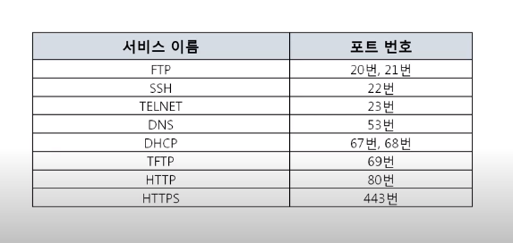

# 컴퓨터의 프로그램끼리는 이렇게 데이터를 주고 받는다

### 4 계층 프로토콜 

- 전송 계층 > 송신자와 수신자의 프로세스를 연결
  - client - server 개념으로 보자 
- UDP 프로토콜 : 연결하든 말든 데이터를 전달!
- TCP 프로토콜: 연결되고 데이터 전달 및 확인 

### 프토 번호 

- well-known 포트 :star:

- server: 실행되는 프로그램  (Ex FTP, DNS etc)
- HTTPS: 443번! (-s 인게 보안관리대상)

- 그 외 Registered 포트, Dynamice 포트 

### 프로그램의 연결정보

- 현재 포트 활성 여부를 나타내는 활성 연결 테이블 
- cmd 창에서 확인 가능 `netstat-ano`

### 따라해보기

- `webshare` 설치 
  - 공유할 파일을 drag drop 해서 server 설정된 포트번호를 실행함 
  - 기본 80으로 고정 