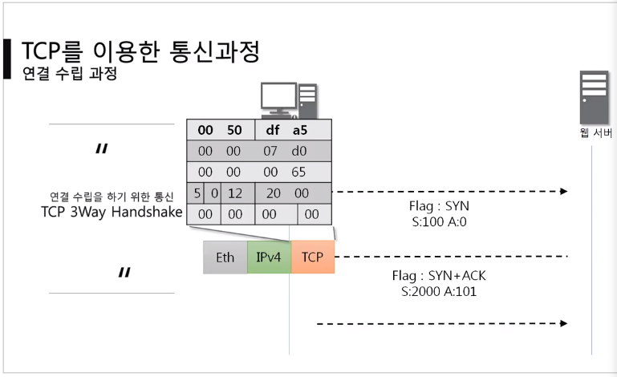
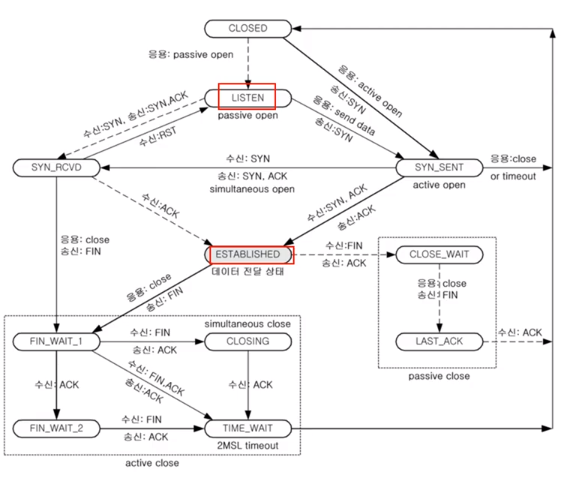

# 09. 연결지향형 TCP 프로토콜 


### :classical_building: TDP 프로토콜 

- 연결을 지향하여 **안정적으로 순서대로 에러없이** 데이터 교환에 집중! 

- UDP 보다 안전하지만 느리다!! (but 차이가 크지 않음 :no_entry_sign: )

- 데이터 수신 입장에서 확인과 전송 과정을 모두 고려하여 데이터 전송 ! 


### :classical_building: TDP 플래그

```bash
UAPRSF 
> 여러가지 형태로 데이터를 보내는데 그 때 발생하는 flag 값 
> TCP 주된 기능이 플래그로 구분 됨 

U - 위치값을 알려줌 
A - 물어본 것에 대한 응답을 승인 
p - push / 데이터가 일정 공간 쌓여야 되는 것을 확인하기 위해 사용 
R - 초기화 / 문제 발생 시 관계를 초기화 
S - 동기화 / 상대방과 연결시작 시 무조건 사용 
F - 종료 
```


### :classical_building: TCP를 이용한 통신과정 

- 둘 사이 연결을 수립하는 과정이 제일 중요 ! :star2:
- 데이터 통신을 할 때 가장 먼저 수행되는 과정 

```python
# 3단계
- client to server 요청 패킷 전송 
- server to client 요청 수락 패킷 전송 
- client 최종 수락
```


< TCP 3Way Handshake > 



`데이터 전송에 따른 Flag 발생` 


#### 데이터 송수신 과정

##### 보낸 쪽에서 또 보낼때는 SEQ 번호와 ACK 번호가 그대로

##### 받는 쪽에서 SEQ번호는 ACK 번호가 됨 

##### 받는 쪽에서 ACK번호는 SEQ번호 + 데이터 크기 

####  

### :classical_building: TCP 상태전이도 

- 점선 client, 실선 server 상태 



Listen -> Estabsliehd (연결 상태 확인)

> 둘 중 어느 상태인지 확인해야 하며 연결이 끝나면 established 가 되면서 연결이 가능해짐! 


> client가 능동적, server가 수동적 


> 패킷 만들어서 서버로 전송 ㅡ 서버는 listening 상태여야 받을 수 있음 
>
> ㅡ 본인이 패킷 제작하여 클라이언트로 전송 ㅡ client가 패킷받아서 active 패킷 전송 


