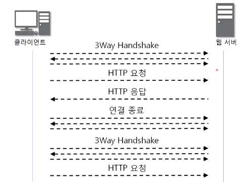
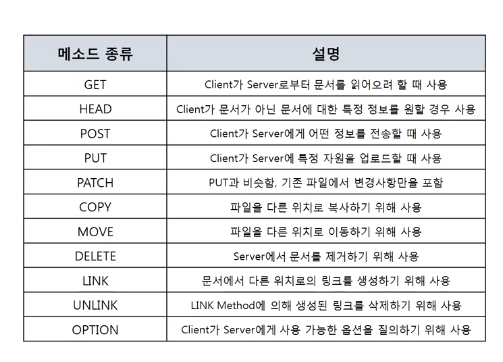
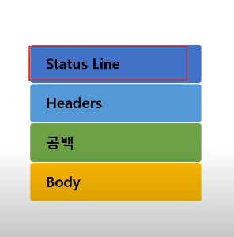
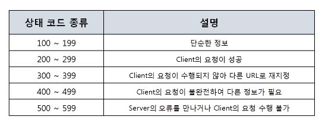

# 11. WWW (7계층 프로토콜)

(6/2)

### :classical_building: HTTP 

> 웹을 만들기 위해 사용되는 기술들 
>
> 필수: HTTP, **HTML(채울 내용), Javascript(기능), CSS(디자인)**, ASP, JSP, DB, PHP
>
> 선택: Python, Spring, Jquery, Ajax 


- HTML, Javascript, CSS > client 작용 (front) 
- ASP, JSP, PHP > server 작용 (back)


##### HTTP 프로토콜 특징

##### - www에서 쓰이는 핵심 프로토콜로 문서전송을 위해 쓰임 

##### - Request / Response에 기반 !! 



### :classical_building: 요청 프로토콜

- Request line - Headers - 공백 - Body 
- 요청 프로토콜 > 요청하는 방식을 정의하고 client 정보를 담고 있음 



// 익숙한 메서드들 몇 개 보인당 

```python
# GET 
GET은 URI로 data를 포함시켜 보낸다.

# POST 
POST는 body에 data를 포함시켜 보낸다. 
```


URI 구조 

`scheme://host[:port][/path][?query]`


### :cloud_with_lightning: URI 실습 

> JAVA 관련 (Java 환경 변수 설정 과정 영상 참고!!!)
>
> 환경변수: 시스템의 환경과 관련된 값을 저장하는 변수
>
> Path: 변수란? 하나의 저장 공간에 값을 저장하는 것 

`javac-version` 으로 버전 확인 

`tomcat` 설치 후 webapps > 폴더 > 폴더에 파일을 생성한 후 url로 파일 데이터 가져올 수 있는지 확인 


### :classical_building: 응답 프로토콜



- 응답의 경우 HTTP버전이 맨앞에! 
- 상태 코드와 상태 문구는 한 쌍! 



- 403: client가 권한이 없는 페이지 요청 
- 404: not found, client가 서버에 없는 페이지 요청 


### :classical_building: HTTP 헤더 포멧   

- content-length: 메시지 바디에 길이를 나타낼 때 쓰인다.
- content-type: 메시지 바디에 들어있는 컨텐츠 종류 
- cookie: 서버로부터 받은 쿠키를 다시 서버에게 전송 
- host: 요청된 url에 나타난 호스트명을 상세하게 표시 
- **user-agent**: client program에 대한 식별 가능 정보를 제공 

추가) server, set-cookie 


### 


