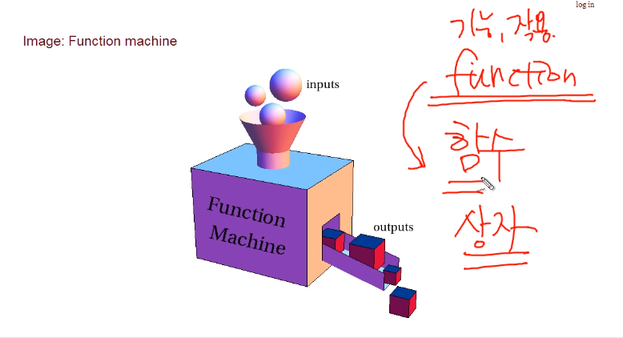
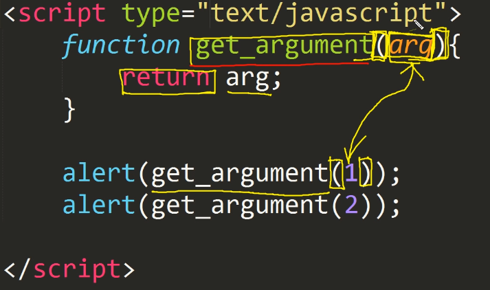

# :cat:1주차 


### 윤서파트

#### :facepunch: 함수

##### 함수-1

함수란? 하나의 로직을 **재실행**할 수 있도록 하는 것으로 코드의 **재사용성**을 높여준다! 

```javascript
function 함수명 ( [인자....]) {
    코드 
    return 반환값 
}
```

예시 코드 

```javascript
/* 바로 1을 출력하는 코드  */
function numbering() {
    document.write(1);
}
numbering(); /*함수 호출 */
```


##### 함수-2

함수가 없다면 같은 코드를 해당 횟수만큼 반복해야 하는 것을 코드로 보여줌 

반복문은 `일정하게 해당 구간에서 실행할 때` 사용되고 

함수는 `여기저기서 호출하여 재사용이 가능하다`는 차이점! 

:ear: 함수 장점 키워드 

- 재사용성
- 유지보수의 용이
- 가독성 개선 


##### 함수-3 (출력)



```javascript
function get_member1(){
    return 'egoing';
}
function get_member2() {
    return 'k8805';
}
alert(get_member1());
alert(get_member2());
/* result
egoing
k8805
*/

function get_member1(){
    return 'yunseo'
    return 'eunji'
    return 'eunchong'
}
/* result
yunseo
*/
```

* **추가** :heavy_plus_sign:

`javascript의 3가지 대화 상자` 

Alert: 단순히 메시지를 전달하며 반환값은 없다 (팝업창으로 메시지 보임)

Confirm: true나 false 를 반환함 

```javascript
<script>
      var jbResult = confirm( 'Lorem ipsum dolor' );
      document.write( jbResult );
</script>
```


Prompt: 사용자가 입력한 값을 받아온다. 


##### 함수-4 (입력)




##### 함수-5 (정의)

다양한 함수 정의 방법

```javascript
numbering = function () {
    i = 0;
    while(i < 10) {
        documente.write(i)
        i += 1;
    }
}

function numbering() {
    i = 0;
    while(i < 10){
        document.write(i);
        i += 1;
    }
}

/* 익명함수 */
(function (){
    i = 0;
    while(i < 10){
        document.write(i);
        i += 1;
    }
})();
```

