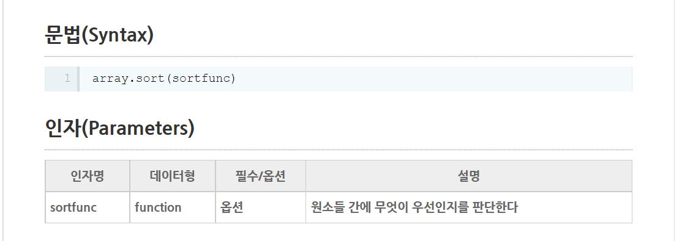
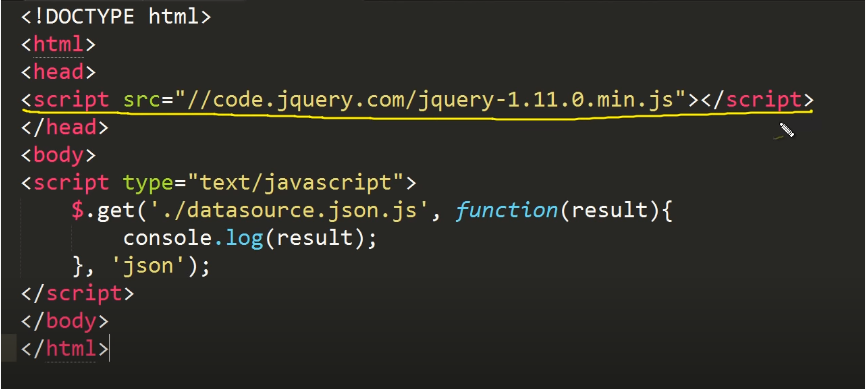

# :cat:2주차 


### 윤서파트

#### :facepunch: 유효범위 (여기서부터 시즌2 시작@; 시즌 3는 객체지향부터)

##### 유효범위-1 전역변수와 지역변수

유효범위: 변수의 수명 

:star: **1번 예시** : fscope함수는 함수 안에 선언되지 않은 vscope에 접근 가능한 것을 보여주는 예시! 

```javascript
var vscope = 'global'
function fscope(){
    alert(vscope);
}
fscope();
```

- 만약 fscope함수 안에 `var vscope = 'local'` 코드가 존재한다면 

  `local`을 출력함! 

> 자기자신에게 가까운 곳에 선언된 변수를 호출하게 된다 ! 
>
> => 지역 변수: `local` / 전역 변수: `global` 


:star: **2번 예시**: 함수 내 지역변수로 선언된 것은 함수 밖에서 호출 불가

```javascript
function fscope(){
    var lv = 'local variable'
    alert(lv) // 'local variable'
}
alert(lv) // undefined 
```


:star: **3번 예시**: 전역, 지역 변수가 중복되어 선언되었을 때


3-1

- 함수 내부에 var로 전연변수 선언
- `var` 사용 시 local 범위 안에서 지역변수로 선언된다. 

```javascript
var vscope = 'global'
function fscope(){
    var vscope = 'local'
}
fscope()
alert(vscope) // 전역 변수인 global 출력 
```

3-2

- 함수 내부에 var 사용 안 했을 시 
- var 사용을 안 할 경우 local이 아닌 전역 변수를 건드리는 것이 됨으로 전역변수를 수정한 후 호출되게 된다. 

```javascript
var vscope = 'global'
function fscope(){
    vscope = 'local' // 전역변수 수정 
}
fscope()
alert(vscope) // 수정된 전역변수인 local 출력 
```

3-3

- 함수 내에 var 사용한 것과 안 한 것 둘 다 사용 시 
- var 로 먼저 지역변수를 선언해버려서 지역변수를 수정하게 됨 

```javascript
var vscope = 'global'
function fscope(){
    var vscope = 'local'
    vscope = 'local'
}
fscope()
alert(vscope) // 함수 내 지역변수 상관없이 전역 변수인global 출력 
```


+추가 

```javascript
var vscope = 'global'
function fscope(){
    vscope = 'local'  // 왜 얘는 전역변수를 수정하지 않을까
    var vscope = 'local'
}
fscope()
alert(vscope) // global 이 출력됨...
```

- 3번줄 vscope가 아직 지역변수가 없기 때문에 

  전역변수인 vscope='global'이 'local'로 수정되었다고 생각했음..

- 근데 왜 global이 출력될까? 


##### 유효범위-2 유효범위의 효용

```javascript
// 함수 안과 밖에 같은 변수 이름이지만 각각 선언했을 때
function a () {
    var i = 0
}
for (var i = 0; i < 5; i ++){
    a();
    document.write(i);
}
// 01234 출력
```

- 만약 2번 줄에 var 선언을 안하면 무한 루프에 빠진다 
- 이유) 4번 줄 i 는 전역변수로 선언된 것이고 function 내에 var 선언을 하지 않아 전역변수인 i 를 바꾸게 돼서 무한 반복된다. 
- `다른 디렉토리라면 파일 이름이 같아도 되는 것과 동일 원리! `


##### 유효범위-3 전역 변수를 사용하는 법

```javascript
var MYAPP = {} // 01. 전역변수로 객체 생성 

// 02. 객체 내 calculator 속성 값으로 left, right를 지정해줌 
MYAPP.calculator = {
    'left' : null,
    'right' : null
}

// 03. 객체 내 coordinate 속성 값으로 left, right 지정 해줌 
MYAPP.coordinate = {
    'left' : null,
    'right' : null
}
// 04. 값 지정 
MYAPP.calculator.left = 10;
MYAPP.calculator.right = 20;

// 05.전역 변수 내 calculator에 접근 
function sum() {
    return MYAPP.calculator.left + MYAPP.calculator.right;
} 
document.write(sum()) // 30 
```

- 코드의 취지 : MYAPP이라는 전역 변수 하나를 통해, 필요에 따라서 속성을 이용해서 값 저장이 가능! 
- 오픈 소스나 다른 사람과 코드를 공유하게 되면 충돌 가능성이 있다. 
  - 이럴 경우 속성을 이용해서 저렇게 구분된 값을 사용 가능! 

- 위의 코드 전체를 `function(){...} ` 안에 넣으면 더 이상 전역변수가 아닌 함수 내 local variable이 된다! 


##### 유효범위-4 함수 

- 지역변수를 선언할 수 있는 경우는 `함수`로 국한됨!

- Java 예시 

```java
for(int i = 0; i < 10; i++){
    String name = 'egoing'
}
System.out.print(name); // error
// name은 지역변수로 for 문 안에서 선언되었는데 for 문 밖에서 호출하기 때문
```

- JavaScript 예시 

```javascript
for (var i = 0; i < 1; i++){
    var name = 'coding everybody'
}
alert(name); // coding everybody
// 자바스크립트에서 지역변수는 함수 내에서만!!
// for, while 등 에서는 지역변수로서의 의미를 가지지 않는다!
```


##### 유효범위-5 정적 유효 범위

-  자바스크립트는 함수가 선언된 시점에서의 유효범위를 갖는다. 

```javascript
var i = 5; // 전역변수 

function a(){
    var i = 10; // 지역변수
    b(); // b 호출 
}

function b(){
    document.write(i); 
}
a(); // 뭐가 나올까!?
```

1. 함수 a 호출 
2. 함수 a 내 지역변수 i = 10
3. b 호출 
4. b 함수에서 찍은 i는 ?! 
   1. 우선 b 내부에 지역변수 찾아봄 -> 없음 
   2. 전역변수를 찾아봄 -> `함수 b가 선언된 시점의 전역변수` 인 5가 출력됨!

:star: b가 호출된 것의 상위 함수인 a의 i=10이 아닌 정의될 때 전역변수 사용!

= 정적 유효범위 (lexical)


<hr>

### :facepunch: 콜백

##### 콜백 -1 (함수의 용도1)

`값으로서의 함수` : JavaScript 에서는 함수도 객체이다. (이해안되도 우선 넘어가자,,) 즉 함수도 특정 변수에 넣을 수 있다! 

- 예시 3가지 

```javascript
var a = function() {}
// 01. 함수를 a 변수로 정의 가능

a = {
    b: function () {
        // 02. 함수를 객체 안에 value 값으로도 저장 가능 
        // 이렇게 객체의 속성 값으로 담겨진 함수는 method라고 함
    }
}
// 03. 그 외에 다른 함수의 인자로 전달 될 수 있다. 
function cal(func, num) {
    return func(num)
}
// func 자리에 다른 함수 넣기 가능 
```

- 함수와 method의 용어적 차이점 


##### 콜백 - 2 (함수의 용도 2)

- 추가 예시 
-  `함수의 리턴값으로도 함수 사용 가능` 

```javascript
function cal(mode){
    var funcs = {
        'plus': function(left, right){return left + right},
        'minus': function(left, right){return left - right}
    }
	return funcs(mode);
}
alert(cal('plus')(2,1)); 
// mode 에 작성한 속성 함수를 찾아서 해당 함수 실행 
// cal('plus') = function(left, right) {return left + right }
```

- 답 3


- `배열의 값으로 함수 사용 `

```javascript
var process = {
    function(input) {return input + 10},
    function(input) {return input * input},
    function(input) {return input / 2}
}
var input = 1
for (Var i = 0; i < process.length; i++){
    input = process[i](input)
}
alret(input)
```

- i에 0, 1, 2가 for문으로 돌아감 
  - 0이 들어가면 첫 번째 식 실행 -> 11
  - 11이 들어가면서 두 번째 식 실행 -> 121
  - 121이 들어가면서 세 번째 식 실행 -> **60.5** 
- 함수 특징을 이용해서 값이 input에 계속 저장된다. 


> 총 정리
>
> 변수, 매개변수, 리턴값 등에 함수가 사용가능한 속성 : first-class citizen object 라고 칭함 


##### 콜백 -3 

> 콜백함수 정의
>
> 1. 다른 함수의 인자로써 이용되는 함수.
>
> 2. 어떤 이벤트에 의해 호출되어지는 함수.
>
> 출처: https://satisfactoryplace.tistory.com/18 [만족]


```javascript
var numbers = [20, 10, 9, 8, 3, 2, 1]
numbers.sort() // 해당 sort 함수로 배열 가능, 여기서 numbers는 배열 객체 
// [1, 10, 2, 20, 3, 8, 9]
```

- 하지만 우리는 숫자 순서대로 정렬되길 원한다 ! 
- 

- `객체.sort()`로 입력 시 기본 sortfunc가 자동으로 실행되는 것이다. 

```javascript
// 기본 실행되는 함수를 변경
var sortfunc = function(a, b){ // a, b는 매차례 비교하는 두 숫자
    if(a > b) {
        return 1;
    } else if (a < b){
        return -1;
    } else {
        return 0
    }
} // return 값을 기준으로 
console.log(numbers.sort(sortfunc)) // 제대로 정렬됨 
```

```javascript
var sortfunc = function(a,b){
	return b-a
}
console.log(numbers.sort(sortfunc)) // 역순 정렬 
```

- 여기서 sortfunc이 콜백함수 역할! 
  - sort method가 기본적으로 동작하는 것을 sortfunc 함수를 지정해줌으로써 완전하게 바꿀 수 있다. 
  - 자바스크립트 함수가 값으로 사용이 가능하기에 콜백함수가 가능하다! 


##### 콜백 - 4 (비동기 콜백 )

- 10,000명의 구독자가 있는 웹 사이트에 글을 작성하고 이메일을 보낸다고 하자
- 한 명 당 1초여도 10,000초!! 
- 글 작성 -> 이메일 발송 -> 작성 완료 과정을 순서대로 진행하여 10,000초 걸리는 것은 동기적 방법 
- 이메일 발송 예약을 걸어두고 작성완료를 먼저 마치면 비동기적 방법 
  - 사용자에게 노출되지 않은 프로그램이 back에서 계속 돌아가고 있는 것


`Ajax` asynchronous javascript and xml 

- 페이지를 reload 하지 않고 서버에서 데이터를 가져오게 함 


- jquery를 이용하여 콜백 함수 구현 (눈으로만 예시 따라가기!)

```html
{"title": "javascript", "author":"egoing"} // 01. 객체 생성 
```

2. 다른 jquery 파일 생성 



- $: jquery의 특수 객체 
- .get 메서드를 통해 위의 01번에 생성한 객체 호출 
- 두번째 인자로 서버에서 호출될 것으로 기대되는 함수를 적음 
- data 가져온 후 함수 실행을 통해 result 출력 

결과: `Object{"title": "javascript", "author":"egoing"}` 

- 콜백을 이용해서(함수를 매개변수로 사용하여) 서버에서 데이터를 가져와서 특정 함수를 실행하게 함. 


### 

### 


