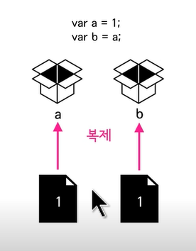
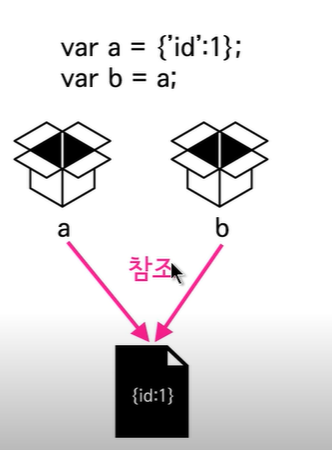

# :cat:3주차 

#### :facepunch: 데이터 타입 


##### 데이터 타입 - 1 (원시 데이터 타입과 객체)

데이터 타입의 대분류

1. 원시 데이터 타입 

= 기본 데이터 타입 

`숫자`, `문자열`, `불리언`, `null`, `undefined` 


2. 객체 데이터 타입 

= 참조 데이터 타입 

원시 데이터가 아닌 모든 데이터 타입 


##### 데이터 타입 - 2 (레퍼 객체)

```javascript
var str = 'coding'
console.log(str.length); // 6
console.log(str.charAt(0));  // "c"
```

- 문자열은 원시데이터 타입인데 왜 객체처럼 동작할까?
- `.` 을 사용한 것은 그 앞에 내용을 객체로 여긴 것임 
  - str은 객체로 작동하고 그게 문자열일 뿐이야 


문자열은 원시데이터 타입이지만 그 것을 `제어` 하기 위해서는 그 문자열이 객체인 것 처럼 동작해야 해당 식들을 이용할 수 있다. 


:stadium: 내부적으로 문자열이 객체로 작동하게 되고 다시 원시타입으로 돌아감 

ex `str = new String('coding')` 


- 객체로 잠시만 작동하고 다시 원래로 돌아온다는 증명 

```javascript
var str = 'coding'
str.prop = 'everybody' 
console.log(str.prop) 
```

- 2번 줄에서 오류가 날까 안 날까?
  - 이 순간에만 내부적으로 String 객체가 만들어져서 .prop을 하는데 오류가 뜨지 않음 
- 3번 줄에서 어떤게 나올까? 
  - undefined - prop 프로퍼티는 바로 제거되기 때문에 prop 속성이 저장된 객체는 바로 존재하지 않게 된다. 

**Wrapper Object**: 원시 데이터 타입이 존재할 때 그것을 감싸주는 객체 (이로 인해 잠시나마 마치 객체인 것처럼 작용하게 해줌 )

> 숫자, 문자열, 불리언 (null과 undefined는 레퍼 객체가 안됨!!)


<hr>

#### :facepunch: 참조

##### 참조 - 1 (복제란?)

```javascript
var a = 1
var b = a
b = 2 
console.log(a) 
```



결과 예측해보기! 

답 : 1 

b는 별도의 데이터로 a 값을 복제한 것이고 b는 2로 바뀌지만 `서로 다른 데이터를 가지고 있기 때문에` a는 바뀌지 않는다! 


##### 참조 - 2 (참조)

복제: 변수에 해당된 값이 **원시데이터 타입**이며 복제한 이후 서로 다른 데이터 값을 의미 


참조: 같은 값을 의미하게 되는 것 

```javascript
var a = {'id':1}
var b = a
b.id = 2
console.log(a.id) // 변경된 2 출력 
```



- a 변수에 id : 1 을 할당 

- 컴퓨터 메모리 상 id:1 데이터가 생성되며 a가 그 데이터를 가르킴 

- 원시 데이터 타입인 경우에는 서로 다른 데이터를 형성했지만, 

  객체를 형성하게 되면 같은 데이터를 가르키게 된다 


- 다른 예시 :question:

```javascript
var a = {'id':1}
var b = a
b = {'id':2}
console.log(a.id) 
```

- a에 객체를 1로 담음
- b는 a 와 같은 객체를 가르킴 
- b는 객체를 2로 새로 생성함!!! 
- b는 더이상 a와 같은 데이터를 바라보는게 아님 > 답은 1 


`데이터 타입`에 따라 참조, 복제 여부가 달라진다. 


##### 참조 - 3 (함수와 참조)

- 원시데이터 타입을 인자로 

```javascript
var a = 1
function func(b){
    b = 2
}
func(a)
console.log(a)
```

- func(a)를 실행하면서 b=a가 됨 
- 함수 안에서 b = 2 그대로고 a = 1 임 
- b=a이기 때문에 b는 a값을 그대로 **복제**하고 b에 1이 담기고 a에는 영향을 안 줌 
- 답은 1


- 참조데이터 타입을 인자로 

```javascript
var a = {'id':1}
function func(b){
    b = {'id':2} 
}
func(a)
cnsole.log(a.id) 
```

- a에 id 1 객체 저장 
- func(a) 돌리면 b=a가 됨 
- 함수 안에서 b 객체는 2로 저장 
- b=a로 인해 같은 객체를 가르키지만 **b는 새로운 객체 2를 만들었기 때문에** 결국은 서로 다른 것을 가르키게 됨 
- a.id 는 그대로 1이 출력! 

- 만약 b = {'id':2} 가 아니라 b.id = 2 라면 참조하고 있는 데이터의 값을 변경시켜서 a,b 둘다 객체 2를 가르키게 된다! 

